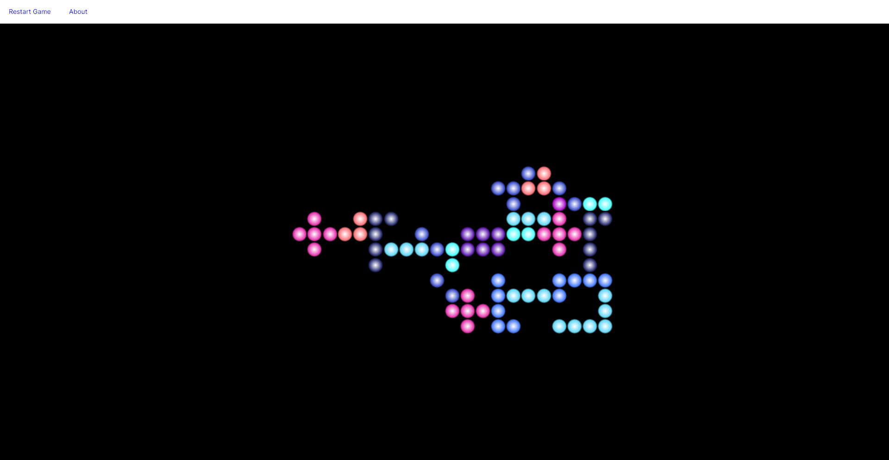

# Bubble Swerve

**Bubble Swerve** is a grid-based falling bubble puzzle game developed in C# using the Avalonia UI framework. It features orientation-aware logic, rotation mechanics, scoring, and a range of unique "bubbloid" shapes that challenge your spatial thinking and reflexes.

> 🧪 This project is being shared for **code evaluation purposes only**. See [LICENSE](./LICENSE) and [NOTICE](./NOTICE) for details.

---

## 🚀 Features

- Custom rotation system for game pieces  
- Shape variation with orientation-aware behavior  
- Developed using modern C# and Avalonia for cross-platform compatibility  
- Clean, modular code structure with object-oriented principles  

---

## 🎮 Try It Out

If you have access to the compiled binary or can run Avalonia apps locally, feel free to play the game. Instructions are provided in the source code or main window.

---

## 👀 For Hiring Managers & Evaluators

You are welcome to:

- Read and review the source code
- Run and interact with the game
- Assess code quality, architecture, and design decisions

You **may not** reuse, redistribute, or modify this code outside of evaluation purposes. Please refer to the [LICENSE](./LICENSE) for full terms.

---

## 🔒 Legal

This project is licensed under a **Proprietary Evaluation License**. All rights reserved by [Scott Forsberg](https://github.com/scottrodeo). Unauthorized use is strictly prohibited.

See [NOTICE](./NOTICE) for further legal notes and third-party information (if applicable).

---

## 📬 Contact

Have questions or need clarification?  
Reach out via GitHub: [@scottrodeo](https://github.com/scottrodeo)

